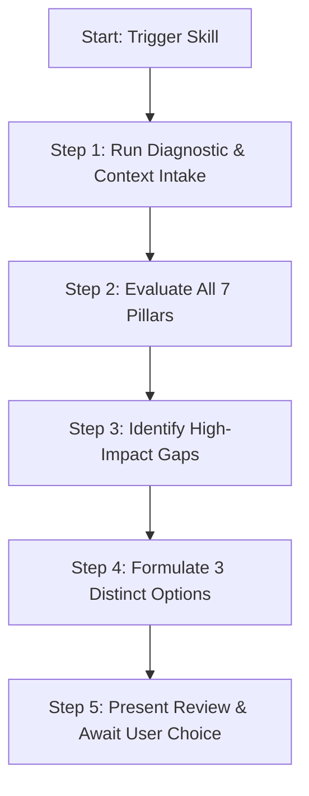

# Pidgin Review & Enhancement Advisor Skill

This skill provides an end-to-end framework to audit, review, and enhance the **ChokePidgin / iSpeakPidgin** application. It evaluates the complete ecosystem across seven core pillars and produces a structured review followed by **3 distinct, high-impact options** for next work.

```
                     ┌───────────────────────────────────────┐
                     │   ChokePidgin Application Review     │
                     └───────────────────┬───────────────────┘
                                         │
        ┌──────────────┬─────────────────┼─────────────────┬──────────────┐
        ▼              ▼                 ▼                 ▼              ▼
   [ Supabase ]  [ ElevenLabs ]   [ Gemini AI ]   [ Pidgin & Slang ]  [ Railway & CI ]
   • Tables      • Voices & Cache • Talk Story    • Phonetics/Audio   • Dockerfile
   • Storage     • Phonetics      • Semantic RAG  • Slang & Phrases   • GitHub Actions
        │              │                 │                 │              │
        └──────────────┴─────────────────┼─────────────────┴──────────────┘
                                         │
                     ┌───────────────────▼───────────────────┐
                     │   Formulate 3 Actionable Options      │
                     │  1. Audio & AI Interactive Fluency   │
                     │  2. Content, Slang & Linguistic Depth │
                     │  3. DevOps, Architecture & Scalability│
                     └───────────────────────────────────────┘
```

---

## The 7 Core Context Pillars

When conducting an application and context review, thoroughly evaluate these 7 pillars:

### 1. Supabase Database & Storage
- **Tables & Schemas**: `dictionary_entries` (650+ words), `phrases` (1,000+), `stories` (22+), `pickup_lines`, `quiz_questions`, `wordle_words`, `crossword_words`, `crossword_puzzles`, `user_profiles`, `user_progress`, `user_xp_transactions`, `user_badges`.
- **Audio & Caching Storage**: Bucket `audio-assets`, table `translation_cache` (hash-keyed audio filenames, direction, voice ID).
- **Security & Performance**: Row Level Security (RLS), service role key separation (`SUPABASE_SERVICE_KEY` vs `SUPABASE_ANON_KEY`), connection pooling, index coverage for search queries and slug lookups.
- **Maintenance Tools**: `tools/data/add-missing-terms.js`, `tools/data/improve-dictionary.js`, `tools/migrate-to-supabase.js`.

### 2. ElevenLabs Text-to-Speech & Pronunciation
- **Voices**:
  - **Kimo** (`f0ODjLMfcJmlKfs7dFCW`) — Authentic local male voice (primary dictionary & default tutor).
  - **Aunty Leilani / Sarah** (`EXAVITQu4vr4xnSDxMaL`) — Warm, mature local aunty.
  - **Braddah Shane / Ethan** (`ErXwbc3VNbCc1k9An9bS`) — Casual surfer / youthful male.
- **Pronunciation Engine**: Phonetic substitution mapping (`tools/testing/pronunciation-audit.js`, `src/components/speech/elevenlabs-speech.js`) converting tricky Pidgin terms (e.g., `da kine` $\rightarrow$ `dah kyne`, `pau` $\rightarrow$ `pow`, `mauka` $\rightarrow$ `mow-kah`, `wikiwiki` $\rightarrow$ `vee-kee-vee-kee`).
- **Audio Pre-generation & Cache**: `tools/audio/audio-pregeneration.js`, `cache-stats.js`, client-side Web Speech API fallback.

### 3. GitHub & CI/CD Pipeline
- **Workflows**: `.github/workflows/ci.yml` running linting, build checks, and validation suites.
- **Automated Validation**: `npm test` (`tools/testing/run-all-tests.js`), master validation (`run-validation.js`), translator validation (`validate-phase-2-3.js`), pronunciation audit (`pronunciation-audit.js`), site link/SEO audit (`audit-site.js`).
- **Version Control & Quality**: Build artifact segregation (`src/` vs `public/`), clean branch management, automated PR validation.

### 4. AI API (Gemini & Semantic RAG)
- **Service Integration**: `services/gemini.js` with structured generation, temperature modulation, and fallback handling.
- **Interactive Tutor (`/api/ai/talk-story`)**: Persona-driven conversation with Kimo, Aunty Leilani, and Braddah Shane, contextual Pidgin vocabulary injection, automatic XP/badge awarding.
- **Semantic Translation (`/api/ai/translate`)**: Tone-adjusted translation (`light`, `standard`, `heavy`), bidirectional English $\leftrightarrow$ Pidgin, RAG retrieval against live dictionary cache.
- **Safety & Rate Limiting**: Bot protection (domain verification), express-rate-limit (`aiChatLimiter`, `semanticSearchLimiter`, `questionSubmitLimiter`).

### 5. Hawaiian Pidgin Linguistics & Pronunciation
- **Grammatical Authenticity**: Preverbal tense-aspect markers (*stay*, *wen*, *go*, *like*), habitual aspect, negation markers (*nevah*, *no*), copula omission, question intonation tags (*yeah?*, *alreadah?*).
- **Orthography & Diacritics**: Proper use of ʻokina (glottal stop) and kahakō (macron) for Hawaiian loanwords, balanced with colloquial phonetic spelling for modern slang.
- **Phonetics Coverage**: Auditing dictionary words against the phonetic dictionary to ensure ElevenLabs sounds local rather than robotic or mainland.

### 6. New Words, Slang & Phrase Opportunities
- **Search Feedback Loop**: Discovering search gaps from Google Search Console queries (`npm run seo:loop`, `tools/seo/feedback-loop.js`).
- **Community & User Submissions**: Pending suggestions review (`routes/suggestions.js`, `tools/check-pending.js`).
- **Curated Slang Expansions**:
  - *Surf & Ocean*: `heavies`, `in da pit`, `junk surf`, `shred da gnar`, `point break`.
  - *Food & Grindz*: `manapua`, `loco moco`, `poke bowl`, `choke grindz`, `kau kau`, `li hing mui`.
  - *Modern & Youth Slang*: `buss up`, `fakafied`, `solid bro`, `too much style`, `guans`.
  - *Idioms & Expressions*: `no make body`, `chicken skin`, `broke da mouth`, `stink eye`, `if can, can`.

### 7. Railway & Production Environment
- **Containerization**: `Dockerfile` (Node.js LTS, production dependencies, build step, port 3000 exposure), `railway.json`.
- **Server Architecture**: Dual runtime (Python `dev-server.sh` for local dev vs Express.js `server.js` for Railway production).
- **Environment & Security**: Required environment variables (`SUPABASE_URL`, `SUPABASE_ANON_KEY`, `SUPABASE_SERVICE_KEY`, `ELEVENLABS_API_KEY`, `GEMINI_API_KEY`, `PORT`), Helmet security policies (especially `mediaSrc: ["blob:", "https://*.supabase.co"]` for audio playback), trust proxy configuration.
- **Build System**: `build.js` pipeline (Terser JS minification, Sharp image optimization, static page generation in `public/`).

---

## Review & Advisory Workflow

When triggered, follow this multi-step review workflow:



### Step 1: Automated Diagnostics & Context Intake
Run the diagnostic script or inspect repository state:
```bash
node .agents/skills/pidgin-review-advisor/scripts/audit-pidgin-app.js
```
Or check individual subsystem commands:
- Validation suite: `npm test`
- Pronunciation coverage: `node tools/testing/pronunciation-audit.js`
- SEO feedback gaps: `node tools/seo/feedback-loop.js --dry-run`
- Build check: `npm run build:quick`

### Step 2: Pillar Assessment
Evaluate strengths and gaps across all 7 pillars:
1. **Supabase**: Data integrity, table row counts, caching status.
2. **ElevenLabs**: TTS voice alignment, phonetic pronunciation map coverage, pre-generated audio files.
3. **GitHub**: CI workflows, test pass rates, build automation.
4. **AI API**: Gemini persona depth, prompt safety, RAG vocabulary injection quality.
5. **Pidgin Linguistics**: Grammatical rules fidelity, phonetic pronunciation accuracy.
6. **Vocabulary & Slang**: Missing high-demand search terms, slang categories ready for addition.
7. **Railway & DevOps**: Dockerfile sanity, environment variable completeness, CSP audio allowances.

### Step 3: Formulate Exactly 3 Recommended Next Work Options
Synthesize the findings into **3 balanced, strategic, and high-impact options** tailored to different priorities:

- **Option 1: Audio & AI Interactive Fluency** (Focus on ElevenLabs voice caching, Gemini Talk-Story personas, pronunciation map expansions, interactive voice features).
- **Option 2: Linguistic Content, Slang & SEO Growth** (Focus on Supabase dictionary/phrase expansion, missing slang terms, Search Console gap closure, static entry page generation).
- **Option 3: Infrastructure, Full-Stack Resilience & Gamification** (Focus on Supabase RLS/indexes, Railway production hardening, CI/CD automated test pipelines, user XP/streak persistence).

### Step 4: Output Presentation Format

Format your review response using this clean structure:

```markdown
# 🌺 ChokePidgin Application & Context Review

## Executive Summary
[2-3 sentences summarizing overall application health, strengths, and primary opportunities]

---

## Pillar Assessment Matrix

| Pillar | Status | Key Strengths | Identified Opportunities |
| :--- | :---: | :--- | :--- |
| **Supabase** | 🟢/🟡/🔴 | [Strengths] | [Gaps/Improvements] |
| **ElevenLabs** | 🟢/🟡/🔴 | [Strengths] | [Gaps/Improvements] |
| **GitHub / CI** | 🟢/🟡/🔴 | [Strengths] | [Gaps/Improvements] |
| **AI API (Gemini)** | 🟢/🟡/🔴 | [Strengths] | [Gaps/Improvements] |
| **Pidgin & Pronunciation** | 🟢/🟡/🔴 | [Strengths] | [Gaps/Improvements] |
| **Slang & New Words** | 🟢/🟡/🔴 | [Strengths] | [Gaps/Improvements] |
| **Railway & Deploy** | 🟢/🟡/🔴 | [Strengths] | [Gaps/Improvements] |

---

## 💡 Recommended Next Work: Choose from 3 Options

### 🌴 Option 1: [Title - e.g., AI Talk-Story & ElevenLabs Audio Expansion]
- **Theme**: [Interactive Audio & AI Experience]
- **Key Deliverables**:
  - [Actionable item 1 with file link]
  - [Actionable item 2 with file link]
  - [Actionable item 3 with file link]
- **Impact**: [High user engagement / authentic audio immersion]
- **Effort**: [Low / Medium / High]

### 🏄 Option 2: [Title - e.g., Slang & Vocabulary Expansion with Search Feedback Loop]
- **Theme**: [Linguistic Richness & SEO Growth]
- **Key Deliverables**:
  - [Actionable item 1 with file link]
  - [Actionable item 2 with file link]
  - [Actionable item 3 with file link]
- **Impact**: [Expanded reach, 50+ new slang entries, higher search rankings]
- **Effort**: [Low / Medium / High]

### ⚙️ Option 3: [Title - e.g., Railway Production Hardening, CI/CD & Supabase Optimization]
- **Theme**: [DevOps, Reliability & Performance]
- **Key Deliverables**:
  - [Actionable item 1 with file link]
  - [Actionable item 2 with file link]
  - [Actionable item 3 with file link]
- **Impact**: [Sub-second query times, robust CI pipeline, zero downtime]
- **Effort**: [Low / Medium / High]

---

## Next Steps
Which option would you like to pursue? Reply with **Option 1**, **Option 2**, or **Option 3** (or a combination), and I will execute the implementation plan immediately.
```

---

## Supporting References & Helpers

- [Linguistics & Slang Taxonomy Guide](./references/linguistics-and-slang.md)
- [Technical Pillars & Architecture Reference](./references/technical-pillars.md)
- [3-Option Recommendation Framework](./references/three-option-framework.md)
- [Diagnostic Audit Script](./scripts/audit-pidgin-app.js)
